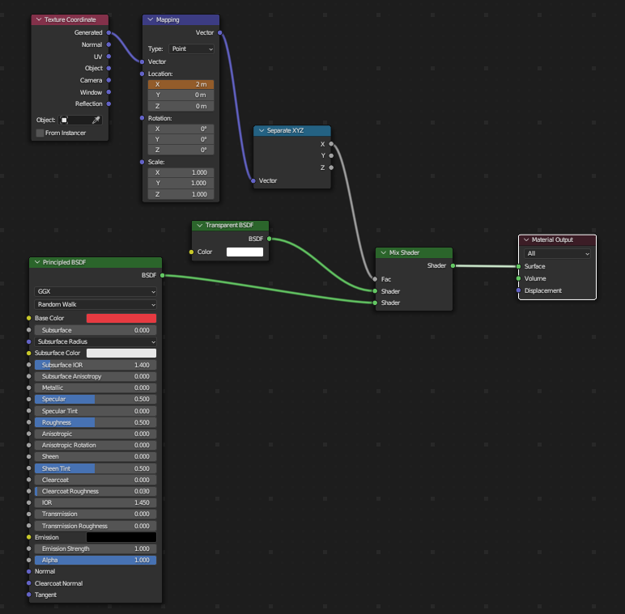
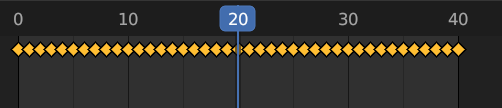
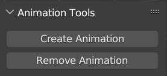
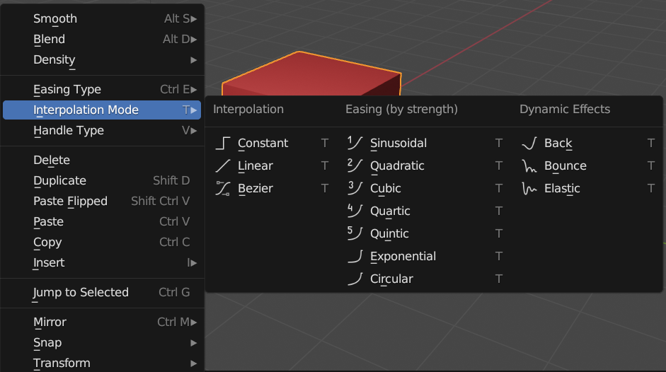
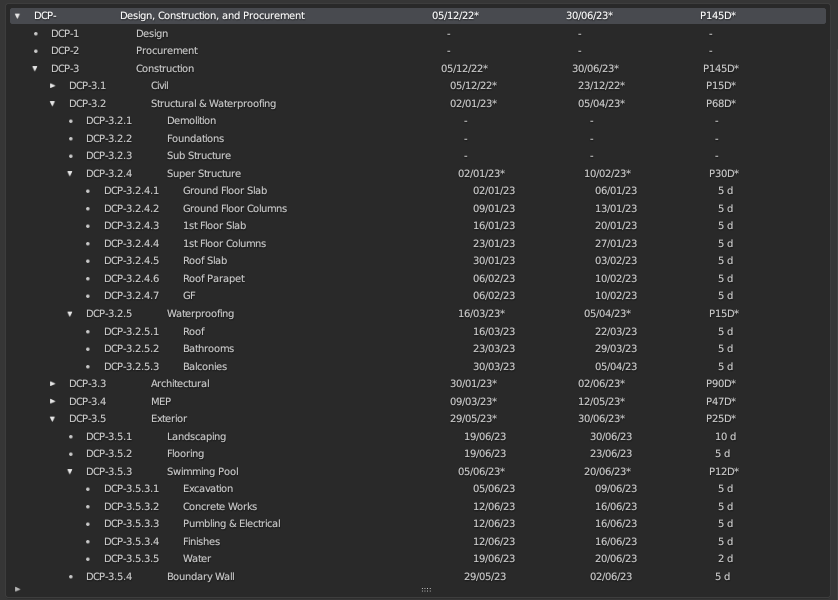
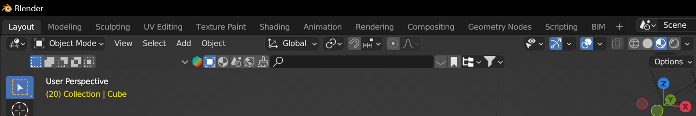
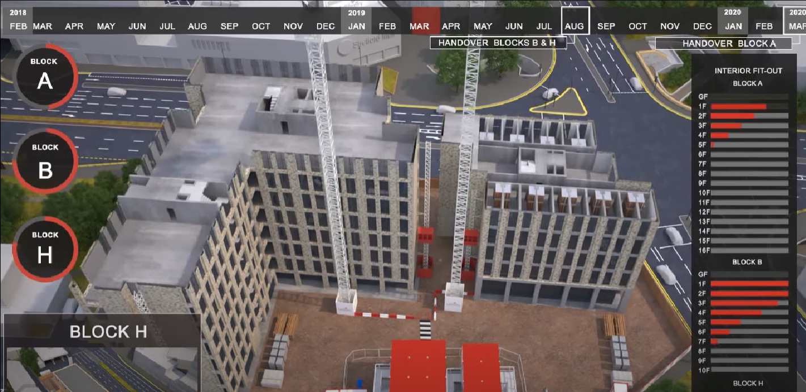
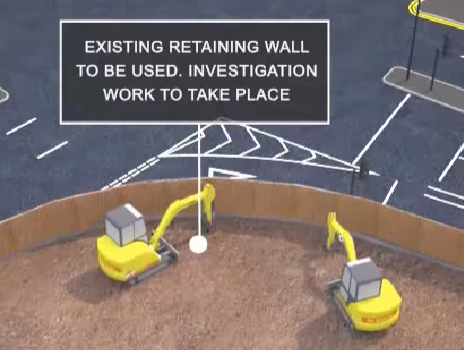

# Contact Information

- **Name**: Chirag Singh
- **Email**: <small>chirag.singh1711@gmail.com</small>
- **IRC Username**: chirag.singh1711
- **GitHub**: [chiragsingh1711](https://github.com/chiragsingh1711)
- **Timezone**: GMT+5:30 IST (Indian Standard Time)
- **Link to resume**: [resume](https://drive.google.com/file/d/12S8VXR0l8jFNrXq6RddP21tzJ10rB4Qi/view?usp=sharing)
- **Have I ever contributed in open source before?**: Yes, I was selected for XROS in 2023. An Open-Source contribution program which was organized by Meta
- **Brief Background Info**: I am proficient in Blender 3D modelling, animation and scripting. I am also a Three JS and XR Developer. I have many project experiences involving all of the above fields.

# Project Overview

## Summary:

The project aims to develop a series of small scripts for Blender that automate the creation of visual animations for construction sequencing. Construction firms often require the ability to visualize project timelines, linking tasks to 3D objects in a seamless manner. This project focuses on automating the animation process, allowing for the automatic generation of animations where building elements appear, disappear, change locations, or stagger their appearances based on the project timeline.

## Objective:

The primary goal is to create a set of Python scripts that integrate with Blender, enabling the animation of visibility, locations, and appearances of building elements in synchronization with a project timeline. These scripts will leverage basic knowledge of animation principles, particularly keyframing, and utilize the capabilities of Blender for seamless integration.

## Expected Outcome:

The project will yield a set of scripts capable of automatically generating animations from Blender, showcasing the dynamic nature of construction projects. The scripts will enable the manipulation of object visibility, locations, and staggered appearances, providing construction firms with a powerful tool for visualizing their projects. Additionally, basic scripts will be developed to correlate real-world time to animation frames and frames per second, allowing for accurate representation of project timelines.

## Sample Outcome Animations:

1. [Skyscraper Construction Animation](https://www.youtube.com/watch?v=ckFIeWsbTsg)
2. [4d construction schedule animation](https://www.youtube.com/watch?v=k2lfuiYmT0w)

# Project Breakdown

<!-- Make it bold -->

## 1. **A script to append nodes to already existing materials within Shader Nodes to finally produce appear, disappear, change locations animations, or stagger their appearances:**

### Objectives:

- Append Nodes from script to the Shader Editor of any material.
- Keyframe the Mapping node to generate the animation.
- Revert back to the previous material properties once the animation is deleted.
- Bring all this in form of Buttons using Blender’s GUI Scripting.

### Approach:

- Using Blender’s Shader Editor, we’ll connect Principal BSDF and Transparent BSDF node with Mix Shader Node and keyframing the Factor Value of Mix Shader node, we’ll be able to animate the visibility of the object. (Blend mode of the material should be turned to Alpha Blend).
  [Sample Video](https://youtu.be/_1QOq643i70?si=ypHa57HQMbrjKCiL)

- Keyframing the X value of Mapping Node to create a transition of appear and disappear staggered animation.

- Creating two buttons for Creating and removing the Shader nodes and animation.

- Later we can interpolate multiple types of animations like – Linear, Sinusoidal, Quadratic, Exponential

### Code for the above Objectives: [AnimationPlusGUI.py](https://github.com/chiragsingh1711/gsoc-2024-Issue-42/AnimationPlusGUI.py)

https://github.com/chiragsingh1711/gsoc-2024-Issue-42/assets/62589134/cc1f542f-fea4-4c36-b815-a90a3800b282

## 2. **Animating the objects based on the Work Breakdown Structure**

### Approach:

- A script already exists in the Blender BIM Addon that calculates which model has to be animated first.
- We just have to interpolate with the existing code and add multiple animation options.

## 3. **Timeline bar as an overlay on 3D Viewport and Rendered Animation**

### Approach:

- A script that interprets project timeline data and dynamically overlay on top of the 3D viewport. This can be achieved by implementing the timeline bar just where the Blender Kit’s addon is placed. It will be the perfect position for the user to interpolate it.

- After very thorough research I came to conclusion that we cannot write our own GLSL code for composting. So, we’ll have to follow the already existing solution that is being used by the addon.

- Therefore, we’ll write a script to dynamically add / modify the Timeline Box and Text in the viewport and make camera as the parent of the Text.

- A script to dynamically add 3D Text Box in the viewport and make camera as the parent of the Text.

# Development Schedule

| Week       | Hours     | Task                                                                        | Description                                                                                                                                                                                       |
| ---------- | --------- | --------------------------------------------------------------------------- | ------------------------------------------------------------------------------------------------------------------------------------------------------------------------------------------------- |
| Week 1-2   | 25 hours  | Project Setup and Familiarization                                           |                                                                                                                                                                                                   |
|            |           | Task 1: Set up Development Environment                                      | Install Blender and necessary Python libraries, ensuring a stable and compatible development environment.                                                                                         |
|            |           | Task 2: Familiarize with Blender's Python API                               | Explore Blender's Python API documentation, gaining an understanding of the key functionalities and capabilities for scripting animations.                                                        |
|            |           | Task 3: Review Existing Project Timelines                                   | Examine different project timeline systems and identify integration points, focusing on understanding how construction tasks are linked to 3D objects.                                            |
| Week 3-4   | 25 hours  | Integration with Project Timelines                                          |                                                                                                                                                                                                   |
|            |           | Task 4: Implement Script Functions for Integration                          | Develop script functions that establish a connection between construction tasks and 3D objects in Blender, creating a seamless integration with project timelines.                                |
|            |           | Task 5: Test Integration with Sample Timelines                              | Create and test sample project timelines to ensure that the developed script functions effectively link construction tasks to the corresponding 3D objects in Blender.                            |
| Week 5-7   | 50 hours  | Object Visibility Animation                                                 |                                                                                                                                                                                                   |
|            |           | Task 6: Develop Script Functions for Visibility Control                     | Implement script functions that utilize keyframing techniques to control the visibility property of 3D objects, allowing for dynamic appearances and disappearances.                              |
|            |           | Task 7: Test Visibility Animations with Simple Scenarios                    | Conduct initial testing with straightforward construction scenarios to validate the visibility animation functionality, ensuring that objects appear and disappear as expected.                   |
| Week 8-9   | 25 hours  | Location Changes Animation                                                  |                                                                                                                                                                                                   |
|            |           | Task 8: Utilize Blender's Animation Capabilities for Location Interpolation | Explore and implement Blender's animation features to interpolate object positions smoothly between keyframes, facilitating realistic movement.                                                   |
|            |           | Task 9: Develop Script Functions for Location Changes                       | Create script functions that automatically set keyframes for location changes, allowing objects to move to different positions during construction tasks.                                         |
| Week 10-11 | 25 hours  | Staggered Appearances Animation                                             |                                                                                                                                                                                                   |
|            |           | Task 10: Introduce Delays Between Start Times and Appearances               | Implement functionality to introduce randomized or predefined delays between the scheduled start times of construction tasks and the appearance of corresponding objects.                         |
|            |           | Task 11: Implement Script Functions for Staggered Appearances               | Develop script functions that automatically adjust keyframes to create staggered appearances, enhancing the visual appeal of the animations.                                                      |
| Week 12-16 | 100 hours | Animated Timeline Bar and Finalization                                      |                                                                                                                                                                                                   |
|            |           | Task 14: Design Animated Timeline Bar                                       | Utilize Blender's animation and graphical capabilities to design visually appealing animated timeline bars, offering users multiple styles to choose from.                                        |
|            |           | Task 15: Develop Script Functions for Timeline Bar Generation               | Create script functions that generate animated timeline bars based on the progression of construction tasks in the project timeline, enhancing the overall visualization.                         |
|            |           | Task 16: Comprehensive Testing, Bug Fixing, and Finalization                | Conduct thorough testing of all implemented features, address any identified bugs or issues, and finalize the scripts. Prepare comprehensive documentation and user guides for seamless adoption. |
| Buffer     | 5 hours   | Additional Buffer Time                                                      | Allocate a small buffer for unforeseen challenges, additional testing, or minor refinements to ensure a polished and reliable Construction Animation Generator.                                   |

# Time Availability

During the contribution period, daily I’ll be able to put in 5 hours/day (30 hours a week) working remotely from Bangalore, India.
10:00 am to 12:00pm IST – 2 hours
6:00 pm to 9:00pm IST – 3 hours

# Why BRL-CAD ?

Contributing to BRL-CAD is an excellent opportunity for several reasons. First and foremost, BRL-CAD has a rich history, dating back to the late 1970s, showcasing its stability and long-term commitment to the open-source community. Your contribution would become part of a legacy that has stood the test of time.

BRL-CAD's versatile applications across various industries, including CAD, computer graphics, and scientific computing, make it a project with diverse use cases. Your involvement could have a significant impact on a tool used in engineering, architecture, virtual reality, and simulation.

# Why Me ?

As my profile closely matches the tech stack used in BRL-CAD—particularly my expertise in Blender, Python scripting, and 3D rendering and animation. My skills align seamlessly with the project's needs, making it an ideal opportunity for me to leverage my existing knowledge while expanding my expertise in a challenging and impactful open-source environment.

Recently in 2023, I was also selected for XR Open-Source (XROS) Contribution Program organised by Meta.

[My Linkedin](https://www.linkedin.com/in/chiragsingh1711/)

# Related Work

Yes, I have worked on a similar project in which the idea was to connect Stable Diffusion with Blender through Blender python scripting.

- A very low poly sample scene would first be created along with a camera in Blender.
- Depth Map of the scene would be generated and sent to Stable Diffusion API along with a prompt that the user may input in the Blender GUI.
- On receiving the output image from Stable Diffusion, the image will then be UV Mapped to the scene from the camera’s perspective.
- Now the user may upload a product to the scene and render high quality images and animations with 3D AI backgrounds.
- (All the above-mentioned tasks were automated using Python)

I also have tons of experience with using Blender for modelling and animation.

[My Blender Portfolio](https://drive.google.com/drive/folders/1WP7O56nRw86tea6WZRFSCRQDhPggMkG3?usp=sharing)
