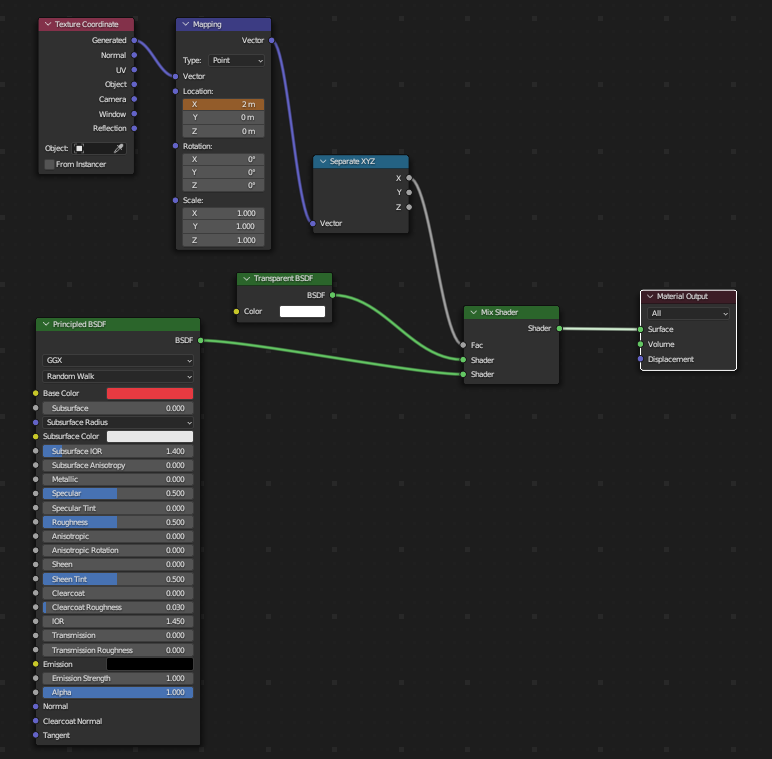
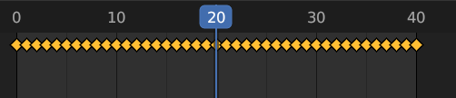
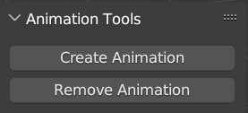
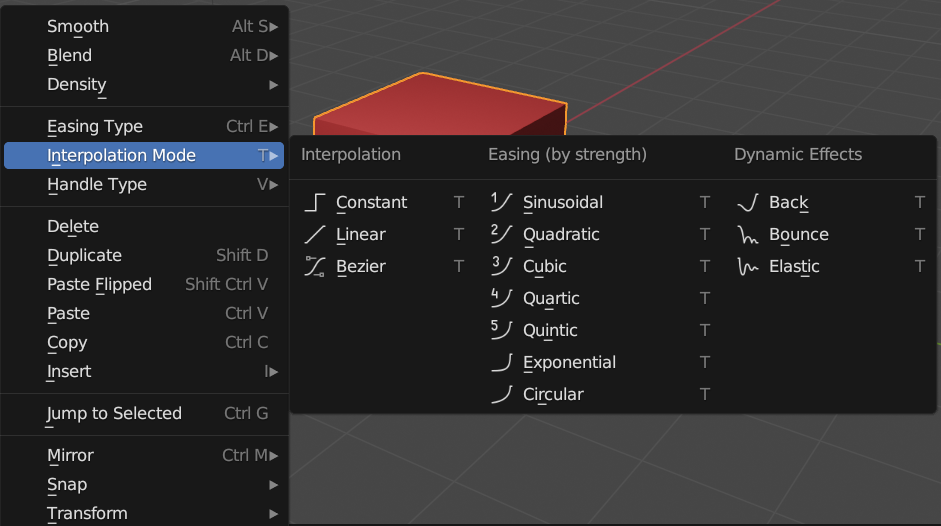

# Contact Information

- **Name**: Chirag Singh
- **Email**: <small>chirag.singh1711@gmail.com</small>
- **IRC Username**: chirag.singh1711
- **GitHub**: [chiragsingh1711](https://github.com/chiragsingh1711)
- **Timezone**: GMT+5:30 IST (Indian Standard Time)
- **Link to resume**: [resume](https://drive.google.com/file/d/12S8VXR0l8jFNrXq6RddP21tzJ10rB4Qi/view?usp=sharing)
- **Have I ever contributed in open source before?**: Yes, I was selected for XROS in 2023. An Open-Source contribution program which was organized by Meta

# Project Overview

## Summary:

The project aims to develop a series of small scripts for Blender that automate the creation of visual animations for construction sequencing. Construction firms often require the ability to visualize project timelines, linking tasks to 3D objects in a seamless manner. This project focuses on automating the animation process, allowing for the automatic generation of animations where building elements appear, disappear, change locations, or stagger their appearances based on the project timeline.

## Objective:

The primary goal is to create a set of Python scripts that integrate with Blender, enabling the animation of visibility, locations, and appearances of building elements in synchronization with a project timeline. These scripts will leverage basic knowledge of animation principles, particularly keyframing, and utilize the capabilities of Blender for seamless integration.

## Expected Outcome:

The project will yield a set of scripts capable of automatically generating animations from Blender, showcasing the dynamic nature of construction projects. The scripts will enable the manipulation of object visibility, locations, and staggered appearances, providing construction firms with a powerful tool for visualizing their projects. Additionally, basic scripts will be developed to correlate real-world time to animation frames and frames per second, allowing for accurate representation of project timelines.

## Sample Outcome Animations:

1. [Skyscraper Construction Animation](https://www.youtube.com/watch?v=ckFIeWsbTsg)
2. [4d construction schedule animation](https://www.youtube.com/watch?v=k2lfuiYmT0w)

# Project Breakdown

<!-- Make it bold -->

1. **A script to append nodes to already existing materials within Shader Nodes to finally produce appear, disappear, change locations animations, or stagger their appearances:**

## Objectives:

- Append Nodes from script to the Shader Editor of any material.
- Keyframe the Mapping node to generate the animation.
- Revert back to the previous material properties once the animation is deleted.
- Bring all this in form of Buttons using Blender’s GUI Scripting.

## Approach:

- Using Blender’s Shader Editor, we’ll connect Principal BSDF and Transparent BSDF node with Mix Shader Node and keyframing the Factor Value of Mix Shader node, we’ll be able to animate the visibility of the object. (Blend mode of the material should be turned to Alpha Blend)[Sample Video](https://youtu.be/_1QOq643i70?si=ypHa57HQMbrjKCiL)

- Keyframing the X value of Mapping Node to create a transition of appear and disappear staggered animation.

- Creating two buttons for Creating and removing the Shader nodes and animation.

- Later we can interpolate multiple types of animations like – Linear, Sinusoidal, Quadratic, Exponential

